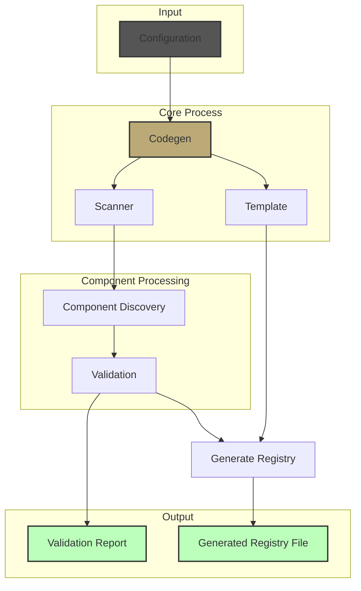

# Component Registry Code Generator

This tool automatically generates a registry of React components and their transformers for a CMS-driven application. It supports multiple dependency injection containers (Inversify, Tsyringe) and provides both programmatic and configuration-file-based usage.

## Table of Contents

- [Features](#features)
- [Installation](#installation)
- [How It Works](#how-it-works)
- [Usage](#usage)
  - [Configuration File](#1-configuration-file)
  - [Programmatic Usage](#2-programmatic-usage)
- [Configuration](#configuration)
  - [Configuration Files](#configuration-files)
  - [Registry Types](#registry-types)
  - [Validation](#validation)
  - [Error Handling](#error-handling)
- [Architecture](#architecture)
  - [Project Structure](#project-structure)
  - [Core Modules](#core-modules)
  - [Configuration](#configuration-1)
  - [Types](#types)

## Features

- 🔍 **Automatic Component Discovery**: Scans your components directory
- 🔄 **Multiple DI Containers**: Supports Inversify and Tsyringe out of the box
- ⚡ **Flexible Configuration**: Use config files or programmatic setup
- ✅ **Validation**: Checks for default exports and proper structure
- 📝 **Detailed Reports**: Get validation reports in JSON format
- ⚠️ **Warning Generation**: Inline warnings in generated code for issues
- 🏗️ **Modular Architecture**: Well-organized, maintainable codebase

## Installation

```bash
# Using npm
npm install @your-scope/codegen

# Using yarn
yarn add @your-scope/codegen

# Using pnpm
pnpm add @your-scope/codegen
```

## How It Works



The tool follows these steps:
1. **Configuration**: Loads and validates configuration from file or programmatic input
2. **Scanning**: Discovers components and their transformers in the specified directory
3. **Validation**: Checks component structure and exports
4. **Generation**: Creates the registry file with proper imports and registrations

## Usage

### 1. Configuration File

Create a `dyesthetics.config.ts` (or any other [supported format](#configuration-files)):

```typescript
import type { CodegenConfig } from '@your-scope/codegen';

const config: CodegenConfig = {
  componentsDir: 'src/components',
  outputFile: 'src/generated/componentRegistry.ts',
  filePatterns: {
    index: {
      names: ['index'],
      extensions: ['.tsx']
    },
    transformer: {
      // Supports multiple patterns with glob-like syntax
      names: ['*.transformer', 'transformer'],
      extensions: ['.ts', '.tsx']
    }
  },
  registry: {
    type: 'inversify',  // or 'tsyringe'
    // Optional: override import settings
    // importPath: './myRegistry',
    // importName: 'myCustomRegistry',
  },
};

export default config;
```

### 2. Programmatic Usage

```typescript
import { Codegen } from '@your-scope/codegen';

async function main() {
  // Example 1: Using file-based configuration (will use inversify by default)
  const fileBasedCodegen = await Codegen.create();
  await fileBasedCodegen.generate();
  
  // Get validation report
  const report = await fileBasedCodegen.getValidationReport();
  console.log(JSON.stringify(report, null, 2));

  // Example 2: Using programmatic configuration with tsyringe
  const programmaticCodegen = new Codegen({
    componentsDir: 'src/components',
    outputFile: 'src/generated/componentRegistry.ts',
    filePatterns: {
      index: { names: ['index'], extensions: ['.tsx'] },
      transformer: { names: ['*.transformer', 'transformer'], extensions: ['.ts', '.tsx'] }
    },
    registry: {
      type: 'tsyringe',
    },
  });
  await programmaticCodegen.generate();
}
```

## Configuration

### Configuration Files

The tool uses [cosmiconfig](https://github.com/cosmiconfig/cosmiconfig) for configuration file support. Supported formats:

- `dyesthetics.config.{js,cjs,mjs,ts}`
- `.dyestheticsrc{,.json,.yaml,.yml,.js,.cjs}`
- `package.json` with "dyesthetics" field

Example output file structure:
```typescript
// THIS FILE IS AUTO-GENERATED - DO NOT EDIT
// Generated on: 2025-06-18T10:00:00.000Z

import Button from "../components/Button";
import buttonTransformer from "../components/Button/button.transformer";
import Menu from "../components/Menu";
import menuTransformer from "../components/Menu/menu.transformer";

widgetRegistryInversify.registerComponent("Button", {
  Component: Button,
  transformer: buttonTransformer,
});

widgetRegistryInversify.registerComponent("Menu", {
  Component: Menu,
  transformer: menuTransformer,
});
```

### Registry Types

#### Inversify (default)
```typescript
{
  type: 'inversify',
  importPath: './widgetRegistry',
  importName: 'widgetRegistryInversify'
}
```

#### Tsyringe
```typescript
{
  type: 'tsyringe',
  importPath: './widgetRegistry',
  importName: 'widgetRegistryTsyringe'
}
```

### Validation

The validation system checks:
1. Component structure:
   - Required files presence
   - File naming conventions
2. Exports:
   - Default exports in components
   - Default exports in transformers
3. Path validity:
   - Component paths
   - Transformer paths

Validation results are provided in three ways:
1. Console warnings during execution
2. Inline comments in the generated registry file
3. Structured JSON validation report

### File Patterns

The tool uses configurable file patterns to locate component and transformer files:

```typescript
interface FilePattern {
  /** Base name without extension (e.g., "index", "transformer") */
  name: string;
  /** Valid extensions for this file (e.g., [".tsx"] or [".ts", ".tsx"]) */
  extensions: string[];
}

interface ComponentFilePatterns {
  /** Main component file pattern */
  index: FilePattern;
  /** Transformer file pattern */
  transformer: FilePattern;
}
```

By default:
- Components are expected to be in `index.tsx` files
- Transformers can be in either `.ts` or `.tsx` files and can include the component name (e.g., `button.transformer.tsx`)

### Error Handling

The tool uses a custom `CodegenError` class with specific error codes for different operations:

```typescript
const enum CodegenErrorCode {
  GENERATION_FAILED = "GENERATION_FAILED", // Overall generation process failed
  WRITE_FAILED = "WRITE_FAILED",          // File write operation failed
  VALIDATION_FAILED = "VALIDATION_FAILED"  // Validation report generation failed
}

try {
  await codegen.generate();
} catch (error) {
  if (error instanceof CodegenError) {
    // Error code is included in the message: [CODE] Description
    console.error('Codegen error:', error.message);
  }
}
```

## Architecture

The codebase is organized into focused modules for better maintainability:

```
codegen/
├── config/               # Configuration management
│   ├── defaults.ts      # Default settings
│   ├── index.ts         # Config loading
│   └── presets/         # Registry presets
│       ├── index.ts
│       └── registry.ts
├── core/                # Core functionality
│   ├── codegen.ts       # Main Codegen class
│   ├── index.ts
│   ├── scanner.ts       # Component discovery
│   └── template.ts      # Code generation
├── types/               # Type definitions
│   ├── component.ts     # Component types
│   ├── config.ts       # Configuration types
│   ├── index.ts
│   ├── template.ts     # Template types
│   └── validation.ts   # Validation types
├── utils/              # Utility functions
│   ├── errors.ts      # Error handling
│   ├── index.ts
│   └── paths.ts       # Path utilities
├── examples/          # Usage examples
│   └── basic-usage.ts
├── index.ts          # Public API
└── README.md
```

### Core Modules

#### Codegen (`core/codegen.ts`)
The main class that orchestrates the component registry generation:
- Handles file-based and programmatic configuration
- Coordinates scanning and template generation
- Provides validation reporting

```typescript
import { Codegen } from '@your-scope/codegen';

// File-based config
const codegen = await Codegen.create();

// Programmatic config
const codegen = new Codegen({...config});

// Generate registry
await codegen.generate();

// Get validation report
const report = await codegen.validate();
```

#### Scanner (`core/scanner.ts`)
Handles component discovery and validation:
- Scans component directories
- Validates component structure
- Checks for default exports
- Reports validation issues

#### Template (`core/template.ts`)
Generates the registry code:
- Creates import statements
- Generates component registrations
- Handles warning comments
- Supports different registry types

### Configuration

#### Config Loading (`config/index.ts`)
Supports multiple configuration methods:
- File-based configuration using cosmiconfig
- Programmatic configuration
- Default fallbacks

#### Registry Presets (`config/presets/registry.ts`)
Pre-configured settings for different DI containers:
- Inversify (default)
- Tsyringe
- Custom registry support

### Types

The type system is organized into domains:

#### Component Types (`types/component.ts`)
```typescript
interface ComponentInfo {
  name: string;
  componentPath: string;
  transformerPath?: string;
  validation?: ValidationResult;
}
```

#### Config Types (`types/config.ts`)
```typescript
interface CodegenConfig {
  componentsDir: string;
  outputFile: string;
  filePatterns: ComponentFilePatterns;
  registry?: RegistryConfig;
}

interface RegistryConfig {
  type: 'inversify' | 'tsyringe';
  importPath?: string;
  importName?: string;
}
```

#### Validation Types (`types/validation.ts`)
```typescript
interface ValidationReport {
  timestamp: string;
  components: Record<string, ComponentValidationInfo>;
  summary: {
    total: number;
    valid: number;
    withWarnings: number;
    withErrors: number;
  };
}
```
